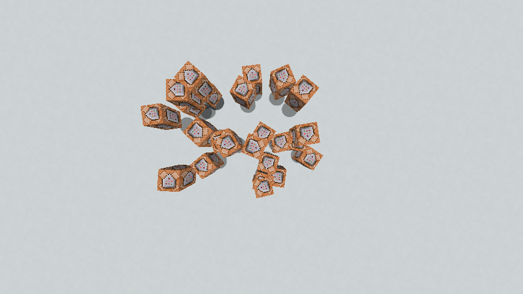

# DisableItemMerge

DisableItemMerge disables item merging by canceling every [ItemMergeEvent]. Item merging can also be disabled on spigot and spigot forks by setting `world-settings.default.merge-radius.item` in [spigot.yml] to `0`, but it will not completely disable it because items that are on top of another will still get merged. Do not set `merge-radius.item` to negative numbers, it will flip the item being merged! DisableItemMerge works on bukkit and bukkit forks.

## Demonstration

### merge-radius.item=0

### DisableItemMerge

[ItemMergeEvent]: <https://hub.spigotmc.org/javadocs/bukkit/org/bukkit/event/entity/ItemMergeEvent.html>
[spigot.yml]: https://www.spigotmc.org/wiki/spigot-configuration/#per-world-settings
